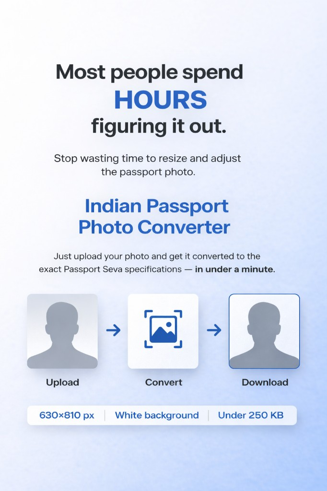

# Passport Photo Formatter

This Streamlit app accepts a JPG/JPEG/PNG portrait and converts it into a passport-style image with:

- `630 x 810` pixels
- JPEG output under `250 KB`
- plain white or off-white background
- head-and-shoulders framing aimed at `80-85%` face coverage

## Run locally with Python

```bash
cd /your path 
python3 -m venv .venv
source .venv/bin/activate
pip install -r requirements.txt
streamlit run app.py
```

Then open:

```text
http://localhost:8501
```

## Run with Docker

Build the Docker image:

```bash
cd your project path
docker build -t passport-photo-app .
```

Run the container:

```bash
docker run --rm -p 8501:8501 passport-photo-app
```

Then open:

```text
http://localhost:8501
```

## Push to a Git repository

Create an empty repository on GitHub, GitLab, or Bitbucket first, then run:

```bash
cd /your project path
git remote add origin <YOUR_REPOSITORY_URL>
git push -u origin codex/passport-photo-app
```

Example repository URLs:

```text
https://github.com/your-user/passport-photo-app.git
git@github.com:your-user/passport-photo-app.git
```

```

## Notes

- The app uses OpenCV face detection to crop around the face automatically.
- It then applies a foreground extraction step and composites the result over an off-white background.
- If a face is not detected, it falls back to a centered crop.
- Docker is useful if you want a consistent runtime on your laptop, server, or cloud VM.
- Use Python `3.11` or `3.12` for local setup and deployment. Avoid `3.13` for now until NumPy/OpenCV C-extension compatibility is fully stable.

---


